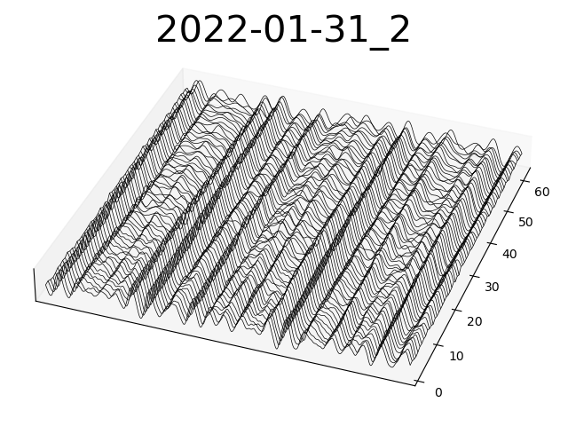

# modwavify

A Python commandline tool to convert wavetables exported from Vital/Vitalium to a format suitable for the Korg modwave. Written with no platform-specific code, so it should run fine in Windows, MacOS, and Linux.

## Why modwavify exists

Vital's wavetable editor exports wavetables as 16 integer-bit-per-sample, 2048 sample-per-wave, 256 wave-per-wavetable .wav files. The modwave doesn't support these directly and they cannot be imported by the modwave librarian. modwavify converts this to a float32-per-sample, 2048 sample-per-wave, 64 wave-per-wavetable .wav file, which can be imported by the modwave. It also always normalizes the wave amplitude.

## Example

    > python modwavify.py wavetable.wav
    wavetable.wav: 88200 samples, Max excursion 0.371002197265625
    wavetable_mw.wav: reduced by factor 4 to 64 waves

This produces two files:
wavetable_mw.wav and wavetable.png

wavetable.png is a waterfall plot, generated by default, that displays the wavetable.

Example wavetable plot:

    > python modwavify.py --help

    Downsamples a 2048-sample-per-wave wavetable to be modwave compatible.

    Options:
    --local / --no-local  Normalize each wave to local (default) or global max.
    --flip                Reverses the wave order in the wavetable.
    --no-thumb            Set this to skip the thumbnail plot.
    --help                Show this message and exit.